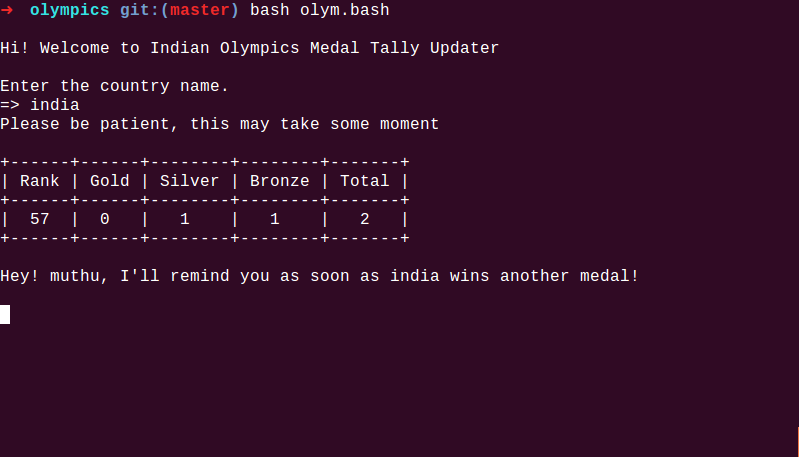

# Olympics Medal Tally Tracker and Remainder

# Installation

## Preinstallations

$ `sudo apt update`

$ `sudo apt install python-prettytable`

## Installing from this repository

To download this repository, you may either clone via git:

$ `git clone https://github.com/lost-plus-found/olympics.git`

$ `cd olympics`

$ `chmod 777 olym.bash`

or download a source code: [olympics](https://github.com/lost-plus-found/olympics/archive/master.zip).

### Running the command

$ `bash oylm.bash`

`Hi! Welcome to Indian Olympics Medal Tally Updater`

`Enter the country name.`

`=> India`

